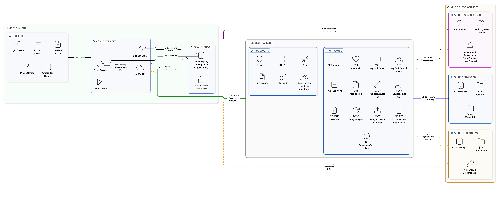
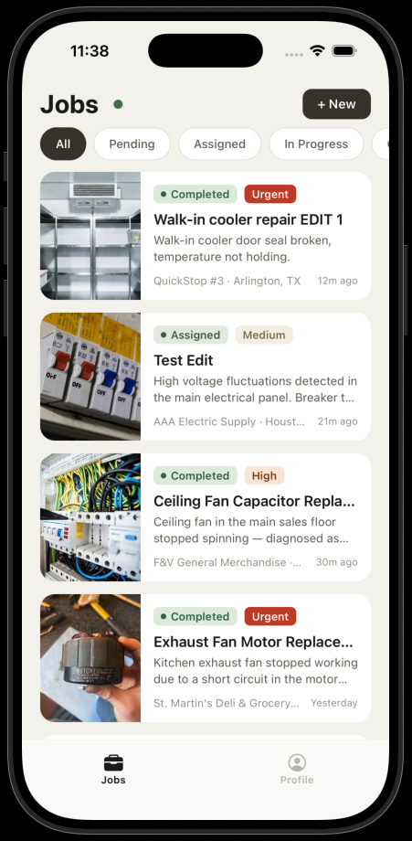
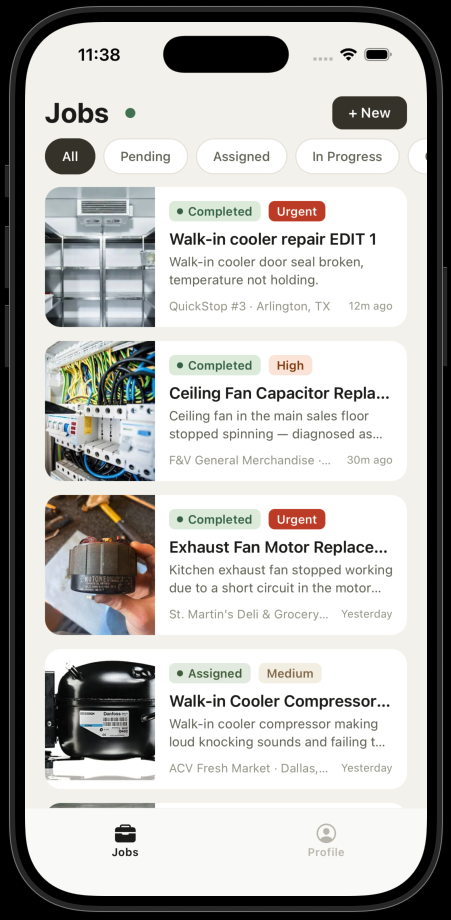
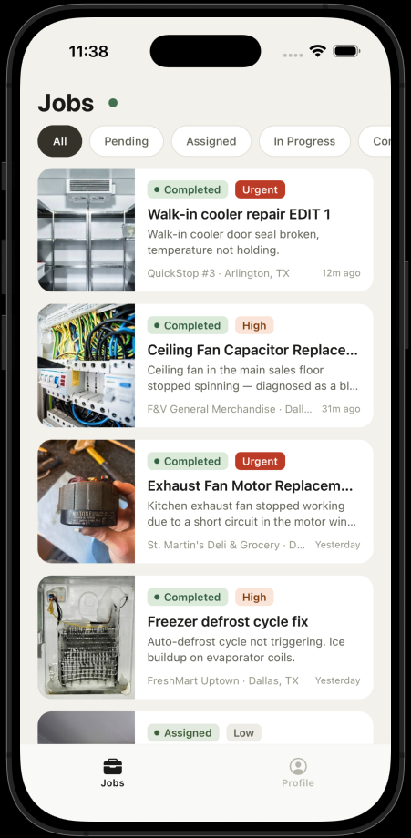
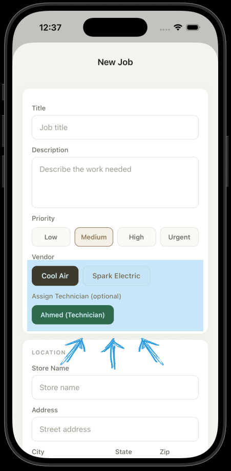
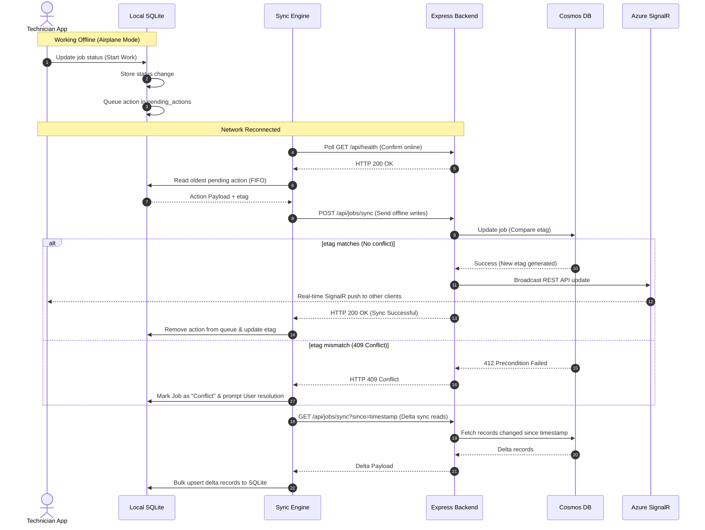

<p align="center">
  
</p>

<h1 align="center">🛠️ FacilitySync</h1>

<p align="center">
  <strong>A Mobile-First Field Service Platform featuring Offline-First Sync, Real-Time Push, Optimistic Concurrency, and Strict RBAC.</strong>
</p>

<p align="center">
  <a href="https://github.com/CSshabbar/Facility_management_Mobile_app"></a>
  <a href="https://www.linkedin.com/in/muhammad-shabbar/" target="_blank"></a>
  <a href="#system-architecture"></a>
  <a href="#offline-first-sync-lifecycle"></a>
</p>

<p align="center">
  <a href="#system-architecture">👁️ System Architecture</a> &nbsp;•&nbsp;
  <a href="#core-features--technical-breakdowns">✨ Core Features</a> &nbsp;•&nbsp;
  <a href="#role-based-experience-demos">👥 Role Demos</a> &nbsp;•&nbsp;
  <a href="#offline-first-sync-lifecycle">🔄 Sync Engine Flow</a> &nbsp;•&nbsp;
  <a href="#engineering-reasoning--operational-policies">📝 Engineering Reasoning</a> &nbsp;•&nbsp;
  <a href="#github-portfolio-power-ups">🚀 Portfolio Power-ups</a>
</p>

---

## 📖 Project Overview

**FacilitySync** is an enterprise-grade, mobile-first field service management solution designed to connect **Facility Admins**, **Vendor Dispatchers**, and **On-Site Technicians** in real time. 

Built to survive challenging field environments with spotty cellular coverage, the system leverages a SQLite-first local write buffer, a transactional sync engine with optimistic concurrency controls, and high-frequency real-time synchronization channels.

### 🛠️ Built With
<p align="left">
  
  
  
  
  
  
  
  
</p>

---

## 🏗️ System Architecture

FacilitySync utilizes a decoupled, event-driven cloud architecture optimized for scale and low database read-load overhead.

```
                  ┌──────────────────────────────┐
                  │      React Native Client     │
                  └──────────────┬───────────────┘
                                 │ HTTP (JSON) & WebSocket (SignalR)
                                 ▼
                  ┌──────────────────────────────┐
                  │    Node/Express 5 Backend    │
                  └──────────────┬───────────────┘
            ┌────────────────────┼────────────────────┐
            ▼                    ▼                    ▼
┌──────────────────────┐ ┌───────────────┐ ┌──────────────────────┐
│  Azure Cosmos DB     │ │ Azure SignalR │ │  Azure Blob Storage  │
│  (Operational Data)  │ │ (Push Channel)│ │  (Media & Attachments)│
└──────────────────────┘ └───────────────┘ └──────────────────────┘
```

* **React Native Client:** Manages offline states dynamically. Interacts *exclusively* with the local SQLite DB for screen renders. 
* **Express Backend:** Stateless API layers handling authentication (JWT), RBAC verification, sync orchestrations, and media streaming tokens.
* **Azure Cosmos DB:** Globally-distributed, document-store partitioned by `tenantId` to ensure total vendor data isolation.
* **Azure SignalR Service (Serverless Mode):** Handles WebSockets outside the App container to prevent connection overhead and state management bottlenecks.
* **Azure Blob Storage:** Holds rich media attachments, authenticated via temporary Shared Access Signature (SAS) credentials.

---

## 👥 Role-Based Experience Demos

The platform alters UI controls, visible workflows, and allowed operations based on the active security role in the JWT.

<table align="center" style="border-collapse: collapse; border: none;">
  <tr>
    <td align="center" valign="top" width="33%" style="border: none;">
      <h4>🔵 Admin View</h4>
      
      <br /><br />
      <strong>Full Visibility & Control</strong>
      <ul align="left" style="font-size: 13px;">
        <li>Sees all jobs across every vendor.</li>
        <li>Create jobs for any vendor.</li>
        <li>Assign, edit, or delete any record.</li>
      </ul>
    </td>
    <td align="center" valign="top" width="33%" style="border: none;">
      <h4>🟡 Dispatcher View</h4>
      
      <br /><br />
      <strong>Vendor-Scoped Management</strong>
      <ul align="left" style="font-size: 13px;">
        <li>Limited to own company's jobs.</li>
        <li>Locked vendor selector.</li>
        <li>Assign own technicians & cancel jobs.</li>
      </ul>
    </td>
    <td align="center" valign="top" width="33%" style="border: none;">
      <h4>🟢 Technician View</h4>
      
      <br /><br />
      <strong>Assigned Task Execution</strong>
      <ul align="left" style="font-size: 13px;">
        <li>Only displays jobs assigned to self.</li>
        <li>No job creation or removal capability.</li>
        <li>Update state & upload photos.</li>
      </ul>
    </td>
  </tr>
</table>

---

## ✨ Core Features & Technical Breakdowns

### 1. Real-Time Multi-User Sync (WebSockets via Serverless SignalR)
When an Admin creates or reassigns a job, it instantly materializes on the assignee's phone without requiring manual refreshes.

* **Broadcasting Mechanics:** The Express backend remains stateless by broadcasting events via REST calls directly to the Azure SignalR Service, which routes WebSockets to targeted group IDs (e.g., `vendor-{vendorId}`, `user-{userId}`, or `admin`).
* **Auto-Recovery:** If connectivity drops, the client triggers an exponential backoff connection loop (2s → 4s → 8s → 15s → 30s) to restore the subscription transparently.

<details>
<summary><b>🔍 Under the Hood: SignalR Publish Flow</b></summary>

```json
// POST /api/jobs/:id/assign
// Backend publishes payload to SignalR REST API endpoint:
{
  "target": "JobAssigned",
  "arguments": [{
    "jobId": "job-100239",
    "status": "assigned",
    "assignedTo": "tech-shabbar",
    "vendorId": "vendor-spark",
    "updatedAt": "2026-06-20T12:56:00Z"
  }]
}
```
*The client app captures `JobAssigned` events on WebSocket channel, immediately performs a transactional upsert into local SQLite DB, updates React state hooks, and triggers fluid UI re-renders.*
</details>

---

### 2. Offline-First Sync Architecture
The client is completely decoupled from API availability for all operational reading and write queuing.

* **SQLite Reads First:** Screens draw data from the local database instantly; network failure results in a silent state change indicator, not loading spinners or failure prompts.
* **FIFO Action Queue:** Offline edits are recorded in a local `pending_actions` table.
* **Draining Strategy:** On reconnect, the sync engine drains the local queue sequentially (executing writes first) before running a delta sync query to download server updates.

```
[Local Action] ──► Write to SQLite ──► Queue to pending_actions ──► Sync Engine (FIFO) ──► Server
```

---

### 3. Optimistic Concurrency & Conflict Detection
FacilitySync rejects the simplistic *Last-Writer-Wins (LWW)* policy because field work status changes carry real-world financial implications.

> [!IMPORTANT]
> **Why LWW is dangerous:** If User A marks a job "completed" (generating invoicing workflows) and User B concurrently marks it "cancelled" offline, LWW would let the last sync overwrite the completion event without review.

* **State Versioning:** Every database document has a unique, system-updated version tag (`_etag`).
* **Conflict Catching:** Every client PATCH request includes the `_etag` version the client last read. The server checks this etag. If mismatched, the server rejects the write with an `HTTP 409 Conflict`.
* **Client Resolution UI:** If an offline action fails on reconnect due to an etag mismatch, the app stops syncing that specific record, marks it as `'conflict'`, and prompts the user to select the master version.

---

### 4. Dynamic Vendor-Filtered Allocation
Prevents human scheduling errors by enforcing relationships programmatically in the client inputs.

<p align="center">
  
</p>

* **Cascading Selectors:** Selecting a vendor dynamically pulls and filters the list of technicians matching the vendor ID.
* **JWT Enforcements:** For dispatchers, the vendor field is locked based on their signed JWT profile values, preventing them from viewing or creating jobs for other vendors.

---

### 5. Secure Media Management with Transient SAS URLs
Allows image storage without ballooning operational document sizes or exposing static, unprotected image URLs.

* **Bypassing App Servers:** Mobile clients upload images to the server which streams them to Azure Blob Storage container (`{tenantId}/{jobId}/{attachmentId}.png`).
* **Expiring Links:** When clients read a job, the server requests a transient Shared Access Signature (SAS) URL from Azure, valid for exactly **1 hour**. The device downloads directly from Blob Storage.

---

## 🔄 Offline-First Sync Lifecycle

This sequence diagram illustrates the lifecycle of offline modification, queue processing, optimistic concurrency check, and delta reconciliation:



---

## 📝 Engineering Reasoning & Operational Policies

<details>
<summary><b>💬 Question 1: System Autonomy vs. Safety Boundaries</b></summary>

### Which actions should never be fully automatic on mobile, and why?

In a field services ecosystem, absolute operational safety takes precedence over pure automation. Several actions require explicit human intent and visual checks:

1. **Contractual Commitments (Vendor Reallocation):** Automatically transferring jobs between vendors based on load balancing can lead to legal issues. For example, if a "Spark Electric" job is automatically reassigned to a competitor, it breaches service-level agreements (SLAs). The app forces dispatchers to select vendors manually.
2. **Data Destruction (Deletion):** True deletion is restricted to administrators and blocked for active jobs. Users must confirm deletions via an alert prompt. Technician devices do not have delete buttons.
3. **Discretionary Cancellation:** Technicians cannot cancel a scheduled task from the field, as they might be close to arriving. Cancellation privileges are restricted to admins and dispatchers and require confirmation prompts.
4. **Mass Administrative Operations:** Bulk operations (such as purging logs or updating status on dozens of records simultaneously) are excluded from the mobile experience to prevent touch-screen errors.
</details>

<details>
<summary><b>💬 Question 2: Sync Failure Handling & Conflict Policies</b></summary>

### How do you handle sync/conflict detection? Why choose optimistic sync over merges?

FacilitySync uses **Optimistic Concurrency Control (OCC)**, using Cosmos DB's native `_etag` feature.

1. **Detection Strategy:**
   * Reads fetch the `_etag` value.
   * Write updates pass the same `_etag` in the header (`if-match`).
   * If another transaction updated the document, Cosmos DB returns `412 Precondition Failed` (handled by the Express layer as `409 Conflict`).
2. **Sync Recovery (Queue Draining):**
   * Online conflicts display an error modal asking users to refresh.
   * Offline actions that hit a `409` on reconnect stop processing. The engine marks the item's local DB status as `'conflict'` and alerts the user to choose which edit to apply.
3. **Tradeoffs Considered:**
   * **Why not Last-Writer-Wins (LWW)?** LWW silently overwrites changes. For example, if a dispatcher cancels a job, and an offline technician updates the status to "complete" later, LWW would discard the cancellation, leading to billing discrepancies.
   * **Why not Auto-Merge?** Merging text fields is straightforward, but merging conflicting status values (e.g., "Cancelled" vs. "Completed") is logically impossible. A explicit review policy keeps operations accurate.
   * **Deletion Healing:** The app performs a full cache sweep every 5 sync cycles to clean up deleted records that delta sync logs might miss.
</details>

<details>
<summary><b>💬 Question 3: Observability, Metrics, and System Event Tracking</b></summary>

### What event instrumentation is required to keep mobile workflows reliable?

Maintaining reliable distributed systems requires tracking network status, sync states, and user actions:

* **Operational Traces:**
  * **Status Lifecycle Events:** Logs changes (e.g., `JobCreated`, `JobAssigned`, `JobStatusChanged`) with `userId`, `role`, `timestamp`, and the changes made, creating a audit path.
  * **Sync Cycle Metrics:** Measures sync durations and conflict rates. Increases in sync duration indicate backend latency or large payload sizes.
  * **Connectivity State Transitions:** Tracks changes like `SignalRDisconnected` or `WentOffline` locally. This telemetry helps identify coverage gaps in the field.
* **Key Performance Indicators (KPIs):**
  * **P95 Sync Latency:** The processing time for the `POST /api/jobs/sync` endpoint must remain under 300ms to handle concurrent client polling.
  * **SignalR WebSocket Latency:** The delivery time for push notifications. Significant latency triggers a fallback to short-polling mode.
  * **FIFO Queue Drain Success Rate:** Identifies actions that repeatedly fail to sync, pointing to edge cases or bugs in client-side business logic.
</details>

<details>
<summary><b>💬 Question 4: Graceful Degradation under Failure</b></summary>

### How does the client app behave when backend services are offline or slow?

The client application degrades gracefully during network loss:

1. **Zero-UI Block:** The app continues to display local data and allows writes while offline. It updates the sync status indicator dot to red to inform the user.
2. **Intelligent Connectivity State Machine:**
   * System listens to OS network alerts.
   * Runs a health poll (`GET /api/health`) every 3 seconds. The app only updates its state to "Offline" after two consecutive poll failures to avoid false positives from network drops.
3. **Queue Prioritization:** If a write times out during synchronization, the engine stops processing the queue. This prevents overloading a struggling server with retry requests.
4. **Push/Poll Adaptive Fallback:** If the SignalR WebSocket disconnects, the app shortens its polling interval to 4 seconds. When the WebSocket connection is restored, the polling interval returns to 10 seconds to conserve battery and reduce network load.
</details>

---

## 🚀 GitHub Portfolio Power-ups

Use these setup configurations to highlight this repository on your GitHub profile and capture recruiter attention:

### 1. Highlight in Profile README
Create a card referencing this case study in your personal GitHub Profile README:

```markdown
### 🚀 Highlighted Project: FacilitySync
An offline-first, mobile-first field service management case study.

*   **Tech Stack:** React Native (Expo) | Express | Azure Cosmos DB | Azure SignalR | Azure Blob Storage | SQLite
*   **Key Features:** Optimistic Concurrency control, Serverless Websockets, Sync Queue.
*   👉 **[Explore the FacilitySync Case Study](https://github.com/CSshabbar/Facility_management_Mobile_app)**
```

### 2. Configure a Repository Social Preview Card
Provide a visual preview of the project for social shares and link previews:
1. Navigate to **Settings** on the top menu bar of this repository.
2. Scroll to the **Social preview** section.
3. Upload `images/architecture-diagram.png` or a custom screenshot to show a preview card when sharing this repository on LinkedIn or Twitter.

### 3. Add Search Tags (Topics)
Make the repository easier to find by adding relevant tags:
* Under the repository description on the right sidebar, click the **cog icon** next to About.
* In the **Topics** field, add: `react-native`, `offline-first`, `azure-cosmosdb`, `signalr-service`, `sqlite`, `optimistic-concurrency`, `system-architecture`.

---

## 📬 Contact & Connect
Let's connect and discuss software architecture, mobile development, or cloud infrastructure!

*   **LinkedIn:** [linkedin.com/in/muhammad-shabbar](https://www.linkedin.com/in/muhammad-shabbar/)
*   **GitHub Repository:** [Facility_management_Mobile_app](https://github.com/CSshabbar/Facility_management_Mobile_app)

